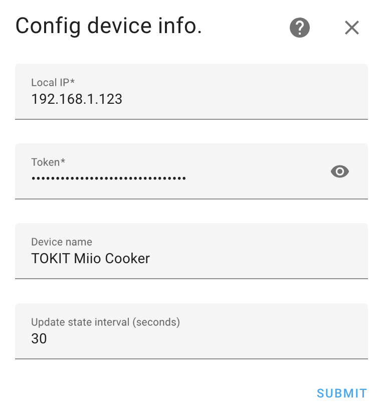
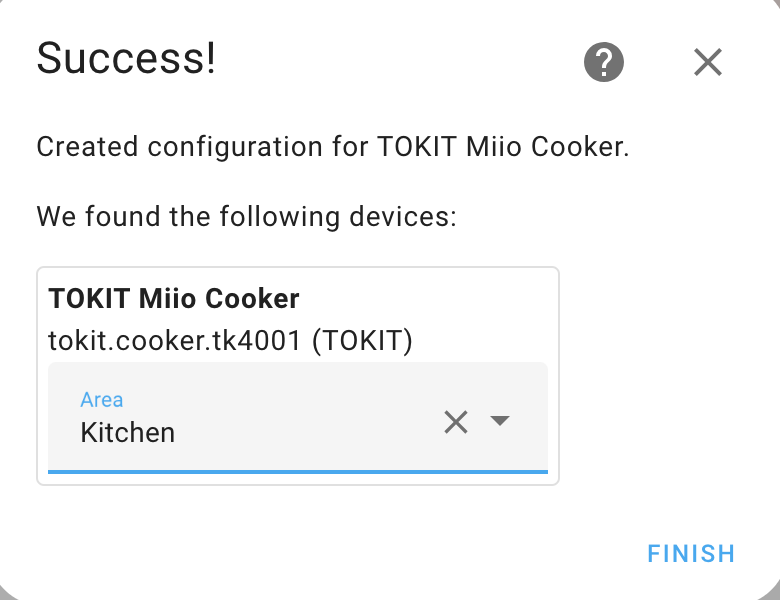
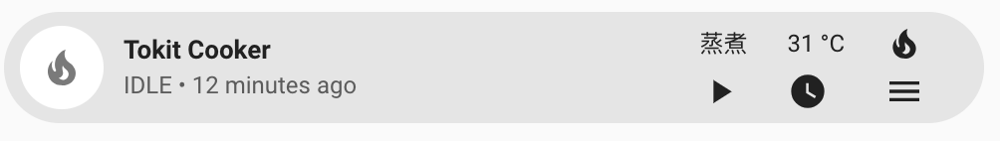
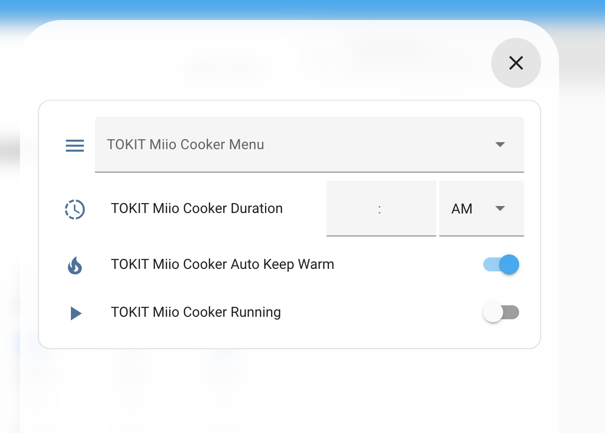
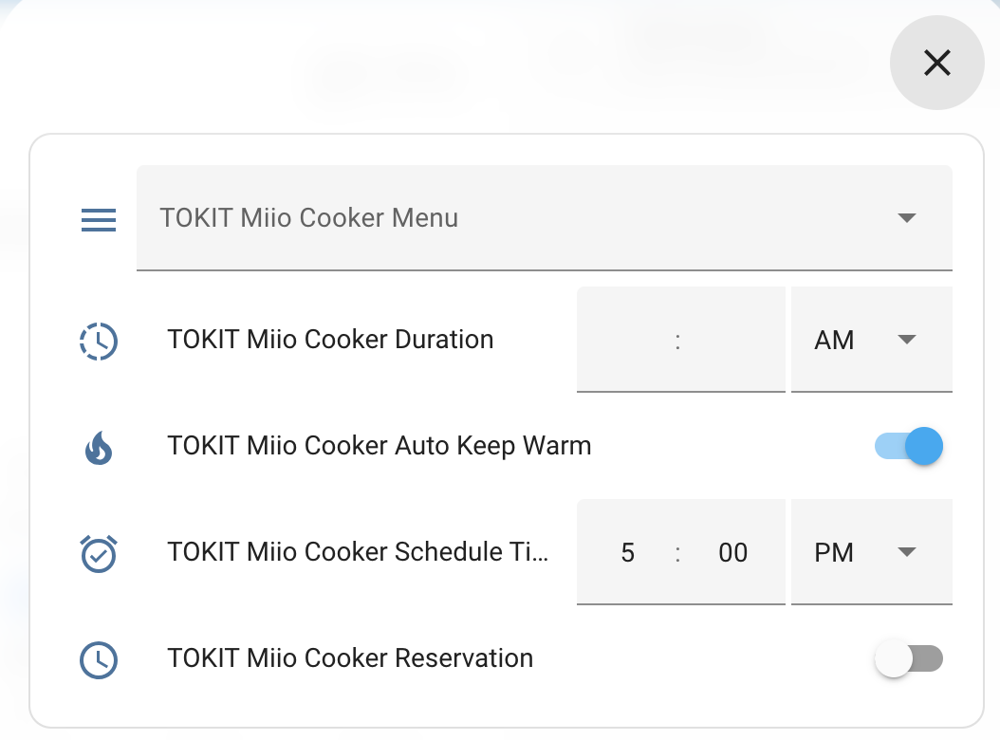
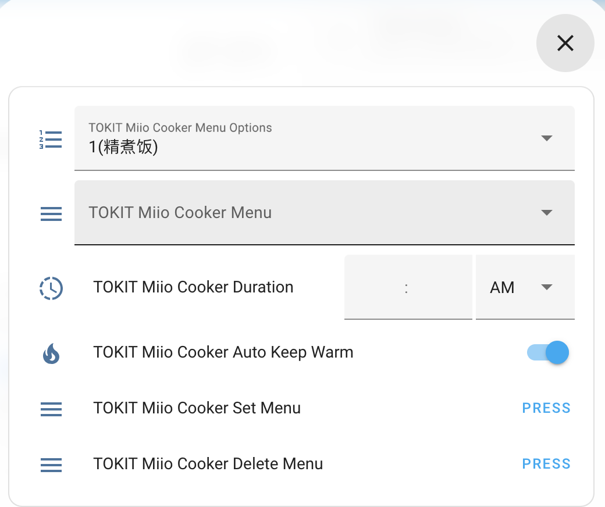

# TOKIT Smart Rice Cooker for Home Assistant
English | [简体中文](https://github.com/oooohhoo/tokit_cooker/blob/master/README_zh.md)

This is a custom component for home assistant to integrate the TOKIT Smart Rice Cooker.

Currently supported device: `tokit.cooker.tk4001`

Please follow the instructions on [Retrieving the Access Token](https://www.home-assistant.io/integrations/xiaomi_miio/#retrieving-the-access-token) to get the API token to use.

Credits: Thanks to [Rytilahti](https://github.com/rytilahti/python-miio) for all the work.

## Features
* Cooker Status
* Start cooking
* Schedule cooking
* Stop cooking
* Set menu
* Delete menu


## Installation
You can install this custom component via [HACS](https://hacs.xyz/). Search for for 'TOKIT Smart Rice Cooker Integration' at the integration page of HACS. Alternatively, you can install it manually by copying the custom_component folder to your Home Assistant configuration folder.

## Setup
### Configuration
[⚙️ Configuration](https://my.home-assistant.io/redirect/config) > Devices and Services > [🧩 Integrations](https://my.home-assistant.io/redirect/integrations) > [➕ Add Integration](https://my.home-assistant.io/redirect/config_flow_start?domain=tokit_cooker) > 🔍 Search `TOKIT Smart Rice Cooker`

Or click: [](https://my.home-assistant.io/redirect/config_flow_start?domain=tokit_cooker)

Add device using host/token and optional name/scan_interval
Configuration variables:
- **host** (*Required*): The IP of your cooker.
- **token** (*Required*): The API token of your cooker.
- **name** (*Optional*): The name of your cooker.
- **model** (*Optional*): The insterval in seconds to scan your cooker

<!--  -->


> Select location

<!--  -->


### Dashboard
Install [Bubble Cards](https://github.com/Clooos/Bubble-Card)

#### Bubble Card 
<!--  -->


```yaml
type: custom:bubble-card
card_type: button
button_type: state
name: Tokit Cooker
icon: mdi:fire
button_action:
  tap_action:
    action: navigate
    navigation_path: '#menu'
entity: sensor.tokit_cooker_tk4001_status
sub_button:
  - entity: sensor.tokit_cooker_tk4001_menu
    show_state: true
    show_name: false
    show_icon: false
    show_background: false
  - entity: switch.tokit_cooker_tk4001_running
    name: ''
    show_name: false
    show_state: false
    show_attribute: false
    show_background: false
    show_icon: true
    tap_action:
      action: navigate
      navigation_path: '#run'
  - name: ''
    entity: sensor.tokit_cooker_tk4001_temperature
    show_icon: false
    show_background: false
    show_state: true
  - entity: sensor.tokit_cooker_tk4001_schedule_time
    name: ''
    show_background: false
    tap_action:
      action: navigate
      navigation_path: '#schedule'
    show_state: false
    show_icon: true
    show_name: false
    show_attribute: false
    show_last_changed: false
  - entity: sensor.tokit_cooker_tk4001_remaining
    show_background: false
    show_icon: false
    show_state: true
  - entity: sensor.tokit_cooker_tk4001_schedule_time
    show_icon: false
    show_background: false
    show_state: true
  - entity: binary_sensor.tokit_cooker_tk4001_auto_keep_warm
    icon: ''
    show_background: false
    show_icon: true
    show_state: false
  - entity: sensor.tokit_cooker_tk4001_menu
    show_background: false
    show_icon: true
    show_arrow: false
    tap_action:
      action: navigate
      navigation_path: '#menu'
show_attribute: false
show_last_changed: true
show_state: true
show_name: true
force_icon: false
show_icon: true
scrolling_effect: true
styles: |-
  .bubble-button-card-container {
      background: ${state === 'IDLE' ? '' : state === 'RUNNING'? '#90EE90': state  === "RESERVATION"? '#87CEFA': state === 'KEEPWARM'? '#FFEBCD':'#F08080'} !important;
    }
  .bubble-sub-button-6 {
      display: ${state  === "RESERVATION"? '' : 'none'} !important;
    }
  .bubble-sub-button-5 {
      display: ${state  !== "RESERVATION" && state !== "IDLE"? '' : 'none'} !important;
    }
  .bubble-sub-button-7 {
      display: ${state  === "IDLE"? '' : 'none'} !important;
    }
card_layout: large-2-rows
```
#### Popup Card
<!--  -->


```yaml
type: vertical-stack
cards:
  - type: custom:bubble-card
    card_type: pop-up
    hash: '#run'
  - type: entities
    entities:
      - select.tokit_cooker_tk4001_menu
      - time.tokit_cooker_tk4001_duration
      - switch.tokit_cooker_tk4001_auto_keep_warm
      - switch.tokit_cooker_tk4001_running
```
<!--  -->


```yaml
type: vertical-stack
cards:
  - type: custom:bubble-card
    card_type: pop-up
    hash: '#schedule'
  - type: entities
    entities:
      - select.tokit_cooker_tk4001_menu
      - time.tokit_cooker_tk4001_duration
      - switch.tokit_cooker_tk4001_auto_keep_warm
      - time.tokit_cooker_tk4001_schedule_time
      - switch.tokit_cooker_tk4001_reservation

```
<!--  -->


```yaml
type: vertical-stack
cards:
  - type: custom:bubble-card
    card_type: pop-up
    hash: '#menu'
  - type: entities
    entities:
      - select.tokit_cooker_tk4001_menu_options
      - select.tokit_cooker_tk4001_menu
      - time.tokit_cooker_tk4001_duration
      - switch.tokit_cooker_tk4001_auto_keep_warm
      - button.tokit_cooker_tk4001_set_menu
      - button.tokit_cooker_tk4001_del_menu

```