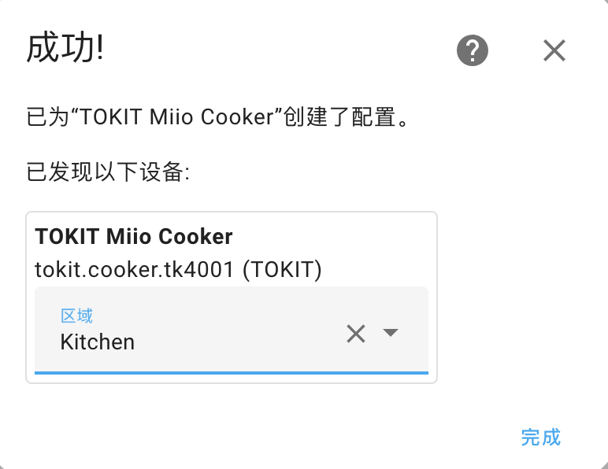
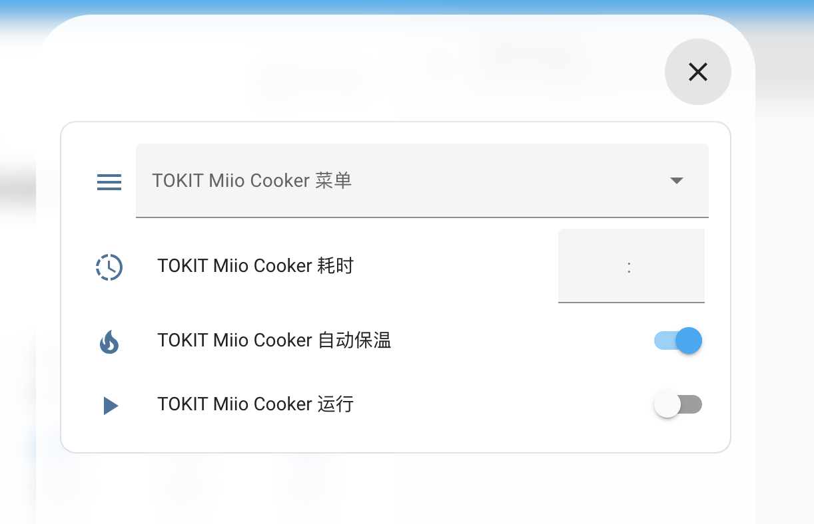
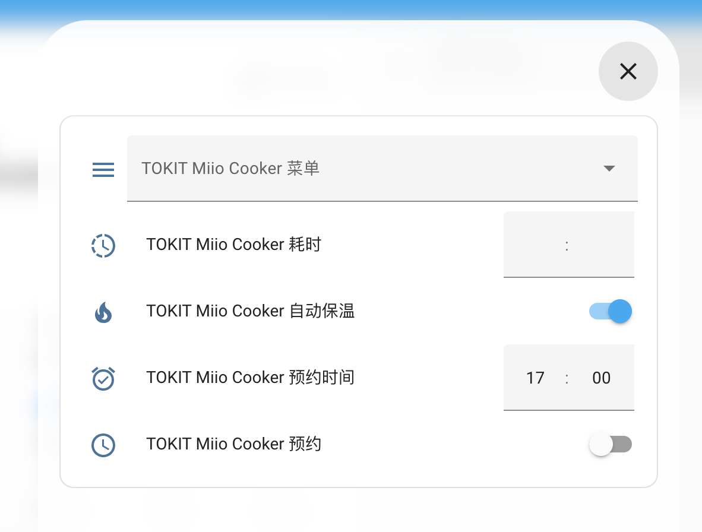
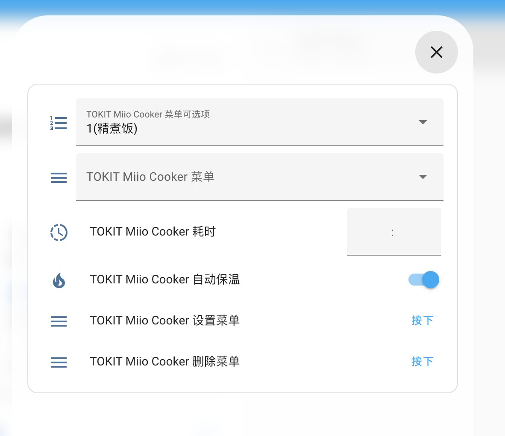

# TOKIT Smart Rice Cooker for Home Assistant

这是一个用于 Home Assistant 的自定义组件，用于集成 TOKIT 智能电饭煲。

当前支持的设备：`tokit.cooker.tk4001`

请按照 [获取访问令牌的说明](https://www.home-assistant.io/integrations/xiaomi_miio/#retrieving-the-access-token) 来获取 API 令牌以供使用。

致谢：感谢 [Rytilahti](https://github.com/rytilahti/python-miio) 的所有贡献。

## 功能
* 电饭煲状态
* 开始烹饪
* 预约烹饪
* 停止烹饪
* 设置菜单
* 删除菜单

## 安装
您可以通过 [HACS](https://hacs.xyz/) 安装此自定义组件。在 HACS 的集成页面搜索 'TOKIT Smart Rice Cooker Integration'。或者，您也可以通过将 custom_component 文件夹复制到 Home Assistant 配置文件夹中进行手动安装。

## 设置
### 配置
[⚙️ 配置](https://my.home-assistant.io/redirect/config) > 设备和服务 > [🧩 集成](https://my.home-assistant.io/redirect/integrations) > [➕ 添加集成](https://my.home-assistant.io/redirect/config_flow_start?domain=tokit_cooker) > 🔍 搜索 `TOKIT Smart Rice Cooker`

或点击：[](https://my.home-assistant.io/redirect/config_flow_start?domain=tokit_cooker)

使用host/token和可选的name/scan_interval添加设备
配置变量：
- **host** (*必填*): 电饭煲的 IP 地址。
- **token** (*必填*): 电饭煲的 API 令牌。
- **name** (*可选*): 电饭煲的名称。
- **scan_interval** (*可选*): 扫描电饭煲的间隔（以秒为单位）。

<!--  -->


> 选择位置

<!--  -->


### 仪表板
安装 [Bubble Cards](https://github.com/Clooos/Bubble-Card)

#### Bubble Card
<!--  -->


```yaml
type: custom:bubble-card
card_type: button
button_type: state
name: Tokit Cooker
icon: mdi:fire
button_action:
  tap_action:
    action: navigate
    navigation_path: '#menu'
entity: sensor.tokit_cooker_tk4001_status
sub_button:
  - entity: sensor.tokit_cooker_tk4001_menu
    show_state: true
    show_name: false
    show_icon: false
    show_background: false
  - entity: switch.tokit_cooker_tk4001_running
    name: ''
    show_name: false
    show_state: false
    show_attribute: false
    show_background: false
    show_icon: true
    tap_action:
      action: navigate
      navigation_path: '#run'
  - name: ''
    entity: sensor.tokit_cooker_tk4001_temperature
    show_icon: false
    show_background: false
    show_state: true
  - entity: sensor.tokit_cooker_tk4001_schedule_time
    name: ''
    show_background: false
    tap_action:
      action: navigate
      navigation_path: '#schedule'
    show_state: false
    show_icon: true
    show_name: false
    show_attribute: false
    show_last_changed: false
  - entity: sensor.tokit_cooker_tk4001_remaining
    show_background: false
    show_icon: false
    show_state: true
  - entity: sensor.tokit_cooker_tk4001_schedule_time
    show_icon: false
    show_background: false
    show_state: true
  - entity: binary_sensor.tokit_cooker_tk4001_auto_keep_warm
    icon: ''
    show_background: false
    show_icon: true
    show_state: false
  - entity: sensor.tokit_cooker_tk4001_menu
    show_background: false
    show_icon: true
    show_arrow: false
    tap_action:
      action: navigate
      navigation_path: '#menu'
show_attribute: false
show_last_changed: true
show_state: true
show_name: true
force_icon: false
show_icon: true
scrolling_effect: true
styles: |-
  .bubble-button-card-container {
      background: ${state === 'IDLE' ? '' : state === 'RUNNING'? '#90EE90': state  === "RESERVATION"? '#87CEFA': state === 'KEEPWARM'? '#FFEBCD':'#F08080'} !important;
    }
  .bubble-sub-button-6 {
      display: ${state  === "RESERVATION"? '' : 'none'} !important;
    }
  .bubble-sub-button-5 {
      display: ${state  !== "RESERVATION" && state !== "IDLE"? '' : 'none'} !important;
    }
  .bubble-sub-button-7 {
      display: ${state  === "IDLE"? '' : 'none'} !important;
    }
card_layout: large-2-rows
```
#### Popup Card
<!--  -->


```yaml
type: vertical-stack
cards:
  - type: custom:bubble-card
    card_type: pop-up
    hash: '#run'
  - type: entities
    entities:
      - select.tokit_cooker_tk4001_menu
      - time.tokit_cooker_tk4001_duration
      - switch.tokit_cooker_tk4001_auto_keep_warm
      - switch.tokit_cooker_tk4001_running
```
<!--  -->


```yaml
type: vertical-stack
cards:
  - type: custom:bubble-card
    card_type: pop-up
    hash: '#schedule'
  - type: entities
    entities:
      - select.tokit_cooker_tk4001_menu
      - time.tokit_cooker_tk4001_duration
      - switch.tokit_cooker_tk4001_auto_keep_warm
      - time.tokit_cooker_tk4001_schedule_time
      - switch.tokit_cooker_tk4001_reservation

```
<!--  -->


```yaml
type: vertical-stack
cards:
  - type: custom:bubble-card
    card_type: pop-up
    hash: '#menu'
  - type: entities
    entities:
      - select.tokit_cooker_tk4001_menu_options
      - select.tokit_cooker_tk4001_menu
      - time.tokit_cooker_tk4001_duration
      - switch.tokit_cooker_tk4001_auto_keep_warm
      - button.tokit_cooker_tk4001_set_menu
      - button.tokit_cooker_tk4001_del_menu

```